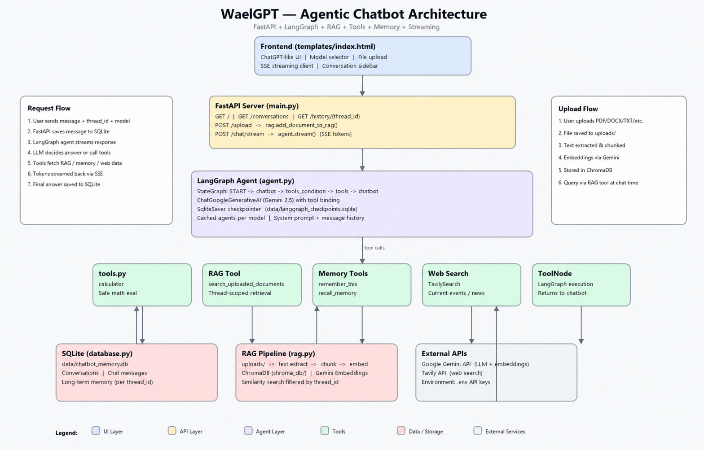
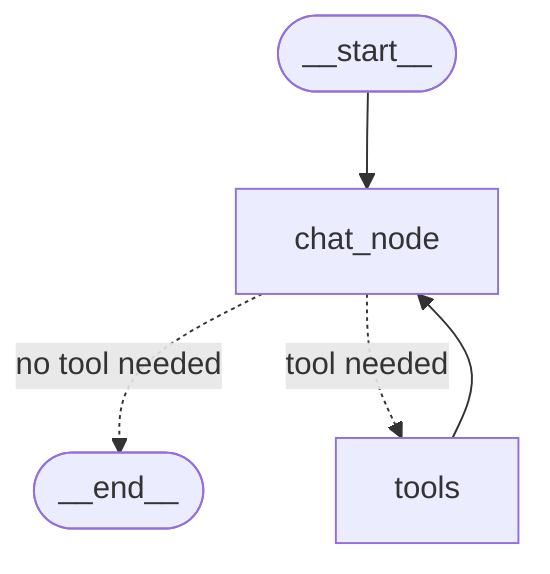

# WaelGPT



WaelGPT is a simple, professional AI assistant web app built with Python.

It works like a personal ChatGPT-style assistant, but it also has tools. It can chat with users, read uploaded documents, search the web, remember useful information, and solve basic math questions. The project is built with FastAPI, LangGraph, LangChain, Google Gemini, Tavily, ChromaDB, and SQLite.

## What WaelGPT Does

WaelGPT gives users one clean place to ask questions and get useful answers.

Users can:

- Chat with an AI assistant in real time.
- Upload documents and ask questions about them.
- Search the web for current or recent information.
- Save useful facts in memory and recall them later.
- Choose from supported Gemini models.
- Use a calculator tool for simple math.
- Continue previous conversations from saved chat history.
- Run the app locally, with Docker, or deploy it to AWS.

## Why This Project Is Useful

Many chatbot demos only answer normal questions. WaelGPT is more useful because it connects the AI model to real tools.

For example:

- A user can upload a PDF and ask for a summary.
- A user can ask for current information, and WaelGPT can search the web.
- A user can ask WaelGPT to remember a preference.
- A user can return later and continue older conversations.
- A developer can deploy the project as a real web app.

This makes WaelGPT a good starting point for AI assistants, customer support bots, internal company knowledge tools, document chat apps, and personal productivity assistants.

## Main Features

### AI Chat

WaelGPT uses Google Gemini through LangChain. It streams answers token by token, so the response appears naturally while the assistant is generating it.

### Document Chat

Users can upload files and ask questions about them.

Supported file types:

- PDF
- DOCX
- TXT
- Markdown
- Python files
- CSV

The app reads the uploaded file, splits it into smaller chunks, stores the chunks in ChromaDB, and retrieves the most relevant parts when the user asks a document question.

### Web Search

WaelGPT uses Tavily Search when a user asks about current information, recent news, latest updates, prices, releases, or other time-sensitive topics.

### Memory

WaelGPT can save important user information in SQLite and recall it later when useful.

Example:

```text
Remember that my business name is WaelGPT.
```

Later, the user can ask:

```text
What do you remember about my business?
```

### Conversation History

Conversations are saved locally with SQLite. Users can open previous chats from the sidebar and continue where they stopped.

### Model Selection

The frontend includes a model selector for supported Gemini models:

- `gemini-2.5-flash`
- `gemini-2.5-pro`
- `gemini-2.5-flash-lite`
- `gemini-1.5-flash`
- `gemini-1.5-pro`

## Tech Stack

| Area | Technology |
| --- | --- |
| Backend | FastAPI |
| Frontend | HTML, CSS, JavaScript, Jinja2 |
| AI model | Google Gemini |
| Agent workflow | LangGraph |
| AI tools | LangChain |
| Web search | Tavily |
| Document search | ChromaDB |
| Embeddings | Google Generative AI Embeddings |
| Database | SQLite |
| Deployment | Docker, GitHub Actions, AWS ECR, AWS EC2 |

## How It Works

1. The user sends a message from the web interface.
2. FastAPI receives the request.
3. LangGraph sends the message to the Gemini model.
4. The AI decides whether it needs a tool.
5. If needed, WaelGPT can use document search, web search, memory, or calculator.
6. The final answer streams back to the browser.
7. The conversation is saved in SQLite.

## Project Structure

```text
WaelGPT/
|-- app.py                  # FastAPI app, routes, uploads, and streaming chat
|-- agent.py                # LangGraph agent and Gemini model setup
|-- database.py             # SQLite conversation and memory storage
|-- rag.py                  # Document reading, chunking, embeddings, and retrieval
|-- tools.py                # Calculator, web search, memory, and document tools
|-- requirements.txt        # Python dependencies
|-- Dockerfile              # Docker image configuration
|-- WaelGPT.png             # Project image used in this README
|-- templates/
|   `-- index.html          # Web chat interface
|-- uploads/                # Uploaded user files
|-- data/                   # SQLite database files
|-- chroma_db/              # ChromaDB vector database
`-- .github/workflows/
    `-- cicd.yaml           # GitHub Actions deployment workflow
```

## Python Files Explained For Beginners

This section explains each Python file in simple words. If you are new to AI agents, read this part first.

### `app.py`

`app.py` is the main web server file. It starts the FastAPI app and connects the browser interface to the AI agent.

Think of this file as the reception desk of WaelGPT. Every user action goes through it first.

What it does:

- Opens the home page with `templates/index.html`.
- Receives user chat messages.
- Streams the AI answer back to the browser.
- Receives uploaded documents.
- Saves user and assistant messages.
- Loads old conversations.
- Connects the frontend to the LangGraph agent.

Important parts:

- `home()` shows the main chat page.
- `conversations()` returns the saved chat list for the sidebar.
- `history(thread_id)` returns messages from one old conversation.
- `upload_document()` accepts PDF, DOCX, TXT, Markdown, Python, and CSV files.
- `chat_stream()` sends the user message to the AI agent and streams the answer back.
- `should_stream_chunk()` hides raw tool output so users only see clean AI text.
- `extract_text_from_chunk()` pulls normal text out of streamed AI chunks.

Beginner idea:

```text
Browser -> app.py -> AI agent -> streamed answer -> Browser
```

### `agent.py`

`agent.py` builds the AI agent brain.

This is where WaelGPT connects to Google Gemini and LangGraph. LangGraph controls the flow: the AI can answer directly or decide to use a tool.

What it does:

- Loads the Gemini model.
- Defines which Gemini models are allowed.
- Creates the system prompt that tells WaelGPT how to behave.
- Connects tools to the AI model.
- Builds a LangGraph workflow with two main nodes: chatbot and tools.
- Saves LangGraph checkpoints in SQLite.
- Caches agents so the app does not rebuild the same model every time.

Important parts:

- `SYSTEM_PROMPT` explains the assistant rules.
- `normalize_model_name()` checks if the selected model is allowed.
- `build_agent()` creates the LangGraph agent.
- `get_agent()` returns an existing agent or creates a new one.

Beginner idea:

```text
User message -> Gemini thinks -> LangGraph decides -> answer or tool use
```

### `tools.py`

`tools.py` contains the tools that the AI agent can use.

An AI agent is more powerful than a normal chatbot because it can call tools. Tools are normal Python functions that the AI can choose when needed.

What it does:

- Creates a calculator tool.
- Creates a document-search tool.
- Creates memory save and memory recall tools.
- Creates a Tavily web-search tool.
- Groups all tools into one `tools` list for the agent.

Important parts:

- `calculator()` solves simple math questions.
- `search_uploaded_documents()` searches uploaded files.
- `remember_this()` saves useful user information.
- `recall_memory()` returns saved memories.
- `web_search` searches the internet using Tavily.
- `set_current_thread_id()` tells tools which conversation is active.

Beginner idea:

```text
Gemini does the thinking.
tools.py gives Gemini actions it can use.
```

### `rag.py`

`rag.py` handles document chat. RAG means Retrieval-Augmented Generation.

In simple words, RAG means the app first searches uploaded documents, finds useful text, and gives that text to the AI so it can answer better.

What it does:

- Reads uploaded files.
- Extracts text from PDF, DOCX, TXT, Markdown, Python, and CSV files.
- Splits long documents into smaller text chunks.
- Creates embeddings from those chunks.
- Stores the chunks in ChromaDB.
- Searches ChromaDB when the user asks about uploaded documents.

Important parts:

- `read_file_text()` extracts text from uploaded files.
- `add_document_to_rag()` turns a document into searchable chunks.
- `retrieve_from_rag()` finds the most relevant chunks for a question.

Beginner idea:

```text
Upload file -> read text -> split text -> store chunks -> search chunks -> answer question
```

### `database.py`

`database.py` stores the app data in SQLite.

SQLite is a small local database. It works as a simple file on your computer, so it is easy to use for learning and small projects.

What it stores:

- Conversation list.
- Chat messages.
- Long-term memories.

Main database tables:

- `Conversation` stores each chat session.
- `ChatMessage` stores user and assistant messages.
- `LongTermMemory` stores saved facts or preferences.

Important parts:

- `init_db()` creates the database tables.
- `create_or_update_conversation()` creates a new chat or updates an old one.
- `list_conversations()` loads the sidebar chat list.
- `save_chat_message()` saves each user or assistant message.
- `get_chat_history()` loads old messages for one conversation.
- `save_memory()` saves a memory.
- `search_memory()` returns saved memories.

Beginner idea:

```text
database.py remembers chats, messages, and saved user facts.
```

### `test.py`

`test.py` is a small developer test file.

It is not the main application. It is used to test the agent directly from Python without opening the browser.

What it does:

- Initializes the database.
- Loads the Gemini agent.
- Sends a test message.
- Prints the streamed response in the terminal.

Important note:

- You normally run the app with `python app.py`.
- Use `test.py` only when you want to test the agent from the command line.

Beginner idea:

```text
test.py checks if the agent can respond without using the web UI.
```

## Beginner AI Agent Flow

Here is the full project flow in simple steps:

1. The user opens the WaelGPT web page.
2. The user sends a message or uploads a document.
3. `app.py` receives the request.
4. `agent.py` sends the message to Gemini through LangGraph.
5. Gemini decides if it can answer directly or if it needs a tool.
6. If a tool is needed, `tools.py` runs the correct tool.
7. If the user asks about a document, `rag.py` searches uploaded document chunks.
8. If the app needs saved chats or memory, `database.py` reads or writes SQLite data.
9. `app.py` streams the final answer back to the browser.

Simple diagram:

```text
Browser
  |
  v
app.py
  |
  v
agent.py
  |
  +--> tools.py
  |      +--> Tavily web search
  |      +--> Calculator
  |      +--> Memory
  |
  +--> rag.py
  |      +--> ChromaDB document search
  |
  +--> database.py
         +--> SQLite chats and memories
```

## LangGraph Workflow

WaelGPT uses a small LangGraph workflow inside `agent.py`.

The workflow is simple:

1. `__start__` begins the graph.
2. `chat_node` sends the user message to Gemini.
3. Gemini decides what to do next.
4. If Gemini can answer directly, the graph goes to `__end__`.
5. If Gemini needs a tool, the graph goes to `tools`.
6. `tools` runs the selected tool, such as web search, document search, memory, or calculator.
7. After the tool finishes, the result goes back to `chat_node`.
8. `chat_node` uses the tool result to create the final answer.
9. The graph finishes at `__end__`.

LangGraph workflow diagram:



Simple explanation:

```text
Start
  |
  v
Chat node asks Gemini what to do
  |
  +--> If no tool is needed: finish
  |
  +--> If a tool is needed: run tool, return result, then answer
```

## Requirements

Before running the project, install:

- Python 3.11
- Git
- A Google Gemini API key
- A Tavily API key

Optional for deployment:

- Docker
- AWS account
- Amazon ECR repository
- EC2 instance
- GitHub Actions self-hosted runner

## Installation

Clone the repository:

```bash
git clone https://github.com/Waelr1985/WaelGPT.git
cd WaelGPT
```

Create a virtual environment:

```bash
python -m venv .venv
```

Activate the virtual environment.

On Windows:

```bash
.venv\Scripts\activate
```

On macOS or Linux:

```bash
source .venv/bin/activate
```

Install dependencies:

```bash
pip install -r requirements.txt
```

## Environment Variables

Create a `.env` file in the project root:

```env
GOOGLE_API_KEY=your_google_gemini_api_key
GEMINI_MODEL=gemini-2.5-flash
TAVILY_API_KEY=your_tavily_api_key

LANGSMITH_TRACING=false
LANGSMITH_ENDPOINT=https://api.smith.langchain.com
LANGSMITH_API_KEY=your_langsmith_api_key
LANGSMITH_PROJECT=waelgpt
```

LangSmith is optional. If you do not use it, keep:

```env
LANGSMITH_TRACING=false
```

Important: never commit your `.env` file to GitHub.

## Run Locally

Start the app:

```bash
python app.py
```

Open the app in your browser:

```text
http://127.0.0.1:8080
```

## Docker

Build the Docker image:

```bash
docker build -t waelgpt .
```

Run the container:

```bash
docker run -d \
  --name waelgpt \
  --restart always \
  -p 8080:8080 \
  --env-file .env \
  waelgpt
```

Open:

```text
http://localhost:8080
```

## AWS Deployment

This project includes a GitHub Actions workflow for AWS deployment.

The workflow can:

1. Build a Docker image.
2. Push the image to Amazon ECR.
3. Pull the latest image on an EC2 server.
4. Stop the old container.
5. Start the new WaelGPT container.

Add these GitHub Actions secrets before using the workflow:

```text
AWS_ACCESS_KEY_ID
AWS_SECRET_ACCESS_KEY
AWS_DEFAULT_REGION
ECR_REPO
GOOGLE_API_KEY
GEMINI_MODEL
TAVILY_API_KEY
LANGSMITH_TRACING
LANGSMITH_ENDPOINT
LANGSMITH_API_KEY
LANGSMITH_PROJECT
```

Example values:

```text
AWS_DEFAULT_REGION=us-east-1
ECR_REPO=waelgpt
GEMINI_MODEL=gemini-2.5-flash
LANGSMITH_TRACING=false
LANGSMITH_PROJECT=waelgpt
```

## Example Prompts

```text
Summarize the PDF I uploaded.
```

```text
Search the web for the latest AI agent news.
```

```text
Remember that my preferred writing style is simple and direct.
```

```text
What do you remember about me?
```

```text
Calculate 125 * 48 / 6.
```

## Good Use Cases

WaelGPT can be used as a starting point for:

- Personal AI assistants
- Document question-answering apps
- Customer support assistants
- Internal knowledge-base chatbots
- Research assistants
- AI agent demos
- FastAPI and LangGraph learning projects

## Security Notes

- Keep API keys in `.env` or GitHub Secrets.
- Do not commit private files, uploaded documents, or database files.
- Review uploaded documents before using the app in production.
- Use restricted AWS permissions for production deployments.
- Rotate any API key that was accidentally exposed.

## License

This project is open source under the Apache 2.0 License. See the `LICENSE` file for details.

## Summary

WaelGPT is a practical AI assistant project that combines chat, document search, web search, memory, and deployment support in one simple application. It is built to be easy to understand, easy to run, and easy to customize for real business or personal use.
